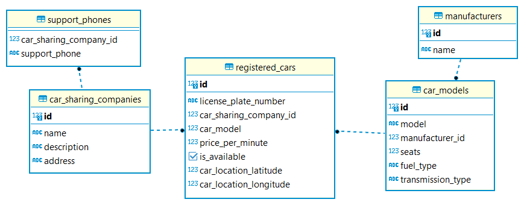

# Car Sharing Monitor

## Описание предметной области

Система для отслеживания каршеринговых автомобилей. Компании предоставляют автомобили для аренды пользователям,
и зарегистрированные автомобили отслеживаются в системе. Каждый зарегистрированный автомобиль связан с моделью
автомобиля, которая содержит информацию о модели, производителе, количестве мест, типе топлива и типе коробки передач. У
каждого автомобиля есть уникальный номерной знак и текущее местоположение, заданное с использованием географических
координат (широта и долгота). Каждый автомобиль также имеет тариф за использование в минуту и флаг, указывающий,
доступен ли он для аренды.

Каршеринговая компания отвечает за предоставление автомобилей для аренды. У компании есть название,
описание, адрес офиса и список номеров телефонов службы поддержки. Она также содержит список зарегистрированных
автомобилей, которые принадлежат компании.

## Композиция

- **Каршеринговая компания** - **Зарегистрированный автомобиль**
- **Модель автомобиля** - **Зарегистрированный автомобиль**

## Классы

**CarModel** - модель автомобиля

- `model: String` - модель автомобиля
- `manufacturer: String` - название производителя
- `seats: int` - количество мест в автомобиле
- `fuelType: FuelType` - тип топлива
- `transmissionType: TransmissionType` - тип коробки передач

**RegisteredCar** - зарегистрированный автомобиль

- `licensePlateNumber: String` - номер автомобиля
- `carSharingCompany: CarSharingCompany` - каршеринговая компания, которой принадлежит автомобиль
- `carModel: CarModel` - модель автомобиля
- `pricePerMinute: BigDecimal` - тариф в минуту
- `location: CarLocation` - текущее местоположение автомобиля
- `isAvailable: boolean` - доступен ли автомобиль

**CarSharingCompany** - каршеринговая компания

- `name: String` - название
- `description: String` - описание
- `address: String` - адрес офиса компании
- `supportPhones: List<String>` - номера телефонов службы поддержки
- `registeredCars: List<RegisteredCar>` - зарегистрированные автомобили компании

**CarLocation** - географические координаты автомобиля

- `latitude: double` - широта
- `longitude: double` - долгота

**TransmissionType (enum)** - тип коробки передач

- `MANUAL` - Ручная коробка передач
- `AUTOMATIC` - Автоматическая коробка передач
- `HYBRID` - Гибридная коробка передач

**FuelType (enum)** - тип топлива

- `PETROL` - Бензин
- `DIESEL` - Дизель
- `ELECTRIC` - Электричество

## Объектно-реляционное отображение

Для задачи объектно-реляционного отображения были приняты следующие решения:

### 1. Добавление идентификаторов

Классам `CarModel`, `CarSharingCompany` и `RegisteredCar` было добавлено поле `id` типа `Long`. Это поле служит
первичным ключом и используется для идентификации объектов в реляционной базе данных.

### 2. Пометка класса как Embeddable

Класс `CarLocation` был помечен аннотацией `@Embeddable`, что означает, что он может быть встроен в другой класс в
качестве его составной части. Это позволяет включить объект `CarLocation` непосредственно в класс `RegisteredCar`.

### 3. Embedded поле

Поле `location` в классе `RegisteredCar` было помечено аннотацией `@Embedded`, что указывает, что это поле является
встроенным объектом. В результате при сохранении объекта `RegisteredCar` в базе данных, его поле `location` будет
сохранено в соответствующей таблице вложенных объектов.

### 4. Отображение enum полей

Для отображения enum полей `TransmissionType` и `FuelType` в реляционной базе данных был использован тип `STRING`.
Значения этих полей будут храниться в виде строк (varchar) в таблицах базы данных.

### 5. Отношение one-to-many

Между классами `CarSharingCompany` и `RegisteredCar` было установлено отношение one-to-many. Для этого в
классе `RegisteredCar` был создан внешний ключ `car_sharing_company_id`, который ссылается на идентификатор
каршеринговой компании. Также такое же отношение было установлено между классами `CarModel` и `RegisteredCar`. В
классе `RegisteredCar` был создан внешний ключ `car_model_id`, который ссылается на идентификатор модели автомобиля.

### 6. Таблица для поддержки телефонов

Для хранения списка телефонных номеров службы поддержки в классе `CarSharingCompany` была создана отдельная
таблица `support_phones`. Эта таблица состоит из двух колонок: `car_sharing_company_id` и `phone`.

### 7. Entity-класс Manufacturer

Для соответствия 2-й нормальной форме для поля `manufacturer` в классе `CarModel` был создан отдельный
entity-класс `Manufacturer`. Этот класс содержит поля `id` и `name`. Было создано отношение many-to-one между
классами `CarModel` и `Manufacturer` путем создания внешнего ключа `manufacturer_id`, который ссылается на идентификатор
производителя.

В итоге была получена следующая схема:



## Требования

Перед началом работы убедитесь, что у вас установлены следующие компоненты:

- Java Development Kit (JDK) версии 17
- Docker (для запуска РСУБД PostgreSQL)

## Установка и запуск

1. Склонируйте репозиторий проекта с помощью команды:

   ```bash
   git clone https://github.com/kshakhnitski/CarSharingMonitor.git
   ```

2. Перейдите в директорию проекта:

   ```bash
   cd CarSharingMonitor
   ```

3. Установите зависимости проекта с помощью Maven Wrapper (mvnw):

   ```bash
   ./mvnw install
   ```

4. Создайте Docker-образ базы данных PostgreSQL для приложения, используя Dockerfile, находящийся в
   директории `docker/postgres`:

   ```bash
   docker build -t car_sharing_monitor_db ./docker/postgresql/
   ```

5. Запустите Docker-контейнер с базой данных, используя ранее созданный Docker-образ:

   ```bash
   docker run -d -p 5432:5432 --name car_sharing_monitor_db car_sharing_monitor_db
   ```

6. При необходимости отредактируйте файлы конфигурации проекта в `src/main/resources/application.yml`

7. Запустите приложение с помощью Maven Wrapper (mvnw):

   ```bash
   ./mvnw spring-boot:run
   ```

Swagger UI доступен по URL - `http://localhost:8080/swagger-ui`

## Зависимости

Проект использует следующие зависимости:

- `Spring (версия 6.0.9)`: Фреймворк для разработки приложений на JVM-языках. Он обеспечивает инверсию управления (IoC)
  и внедрение зависимостей (DI), что упрощает управление объектами и их взаимосвязи в приложении. Spring также
  предлагает модульную структуру, которая позволяет разработчикам выбирать и использовать только необходимые модули,
  делая разработку более гибкой и расширяемой.
- `Spring Boot (версия 3.1.0)`: Фреймворк, основанный на фреймворке Spring, который облегчает создание и развертывание
  приложений. Он предоставляет конфигурацию по умолчанию и автоматическое управление зависимостями. За счёт
  этого он позволяет разработчикам сосредоточиться на бизнес-логике своих приложений, минимизируя необходимость в явной
  конфигурации и управлении.
- `Spring Boot Starter Web (версия 3.1.0)`: Предоставляет все необходимое для разработки веб-приложения с
  использованием
  Spring MVC в рамках Spring Boot. Включает в себя следующее:
    - `Spring MVC`: Фреймворк веб-приложений, использующий Servlets API и модель MVC для разработки веб-приложений. Он
      упрощает создание контроллеров и обработку HTTP-запросов и создание HTTP-ответов.
    - `Встроенный контейнер сервлетов`: Spring Boot включает в себя встроенный контейнер сервлетов (использовался
      Tomcat), что позволяет запускать веб-приложение без необходимости настройки и развертывания отдельного
      контейнера сервлетов.
- `Spring Boot Starter Data JPA (версия 3.1.0)`: Обеспечивает интеграцию JPA с Spring Boot и упрощает работу с базой
  данных в приложении. Включает в себя следующее:
    - `Spring Data JPA`: Предоставляет мощные функции для создания интерфейсов репозиториев для работы с базой данных.
      Имплементация репозиториев создаётся фреймворком автоматически на основе названий методов репозитория.
    - `Hibernate (версия 6.2.2)`: Популярная реализация JPA, которая является стандартом для работы с
      объектно-реляционным отображением (ORM) в Java. Он обеспечивает отображение Java-объектов на таблицы реляционной
      базы данных.
- `Spring Boot Starter Validation (версия 3.1.0)`: Зависимость для валидации объектов. В моём случае использовалась
  для валидации объектов в теле HTTP-запроса.
- `PostgreSQL JDBC-драйвер (версия 42.6.0)`: Представляет собой драйвер JDBC для работы с PostgreSQL базой данных в
  Java-приложениях.
- `Lombok (версия 1.18.26)`: Зависимость для автоматической генерации геттеров, сеттеров и другого повторяющегося
  кода.
- `MapStruct (версия 1.5.5)`: Зависимость для генерации мапперов между классами.
- `Flyway (версия 9.16.3)`: Зависимость для управления миграциями базы данных. В приложении использовалась для
  инициализации схемы БД.
- `SpringDoc OpenAPI Starter WebMVC-UI (версия 2.1.0)`: Предоставляет интеграцию с OpenAPI и Swagger UI в проекте на
  основе фреймворка Spring. Она позволяет генерировать и представлять документацию API в удобном веб-интерфейсе.

## Запросы

### 1. Производитель автомобилей

#### 1.1 Добавить производителя автомобилей

**Запрос:**

```bash
curl -X 'POST' \
  'http://localhost:8080/api/v1/manufacturers' \
  -H 'accept: application/json' \
  -H 'Content-Type: application/json' \
  -d '{
  "name": "Manufacturer B"
}'
```

**Ответ:**

201 Created

```json
{
  "id": 1,
  "name": "Manufacturer B"
}
```

#### 1.2. Получить всех производителей автомобилей

**Запрос:**

```bash
curl -X 'GET' \
  'http://localhost:8080/api/v1/manufacturers' \
  -H 'accept: application/json'
```

**Ответ:**

200 OK

```json
{
  "content": [
    {
      "id": 0,
      "name": "Manufacturer A"
    },
    {
      "id": 1,
      "name": "Manufacturer B"
    }
  ],
  "pageable": {
    "sort": {
      "empty": true,
      "unsorted": true,
      "sorted": false
    },
    "offset": 0,
    "pageNumber": 0,
    "pageSize": 20,
    "paged": true,
    "unpaged": false
  },
  "last": true,
  "totalElements": 2,
  "totalPages": 1,
  "size": 20,
  "number": 0,
  "sort": {
    "empty": true,
    "unsorted": true,
    "sorted": false
  },
  "first": true,
  "numberOfElements": 2,
  "empty": false
}
```

#### 1.3. Получить производителя автомобилей

**Запрос:**

```bash
curl -X 'GET' \
  'http://localhost:8080/api/v1/manufacturers/1' \
  -H 'accept: application/json'
```

**Ответ:**

200 OK

```json
{
  "id": 1,
  "name": "Manufacturer B"
}
```

#### 1.4. Обновить производителя автомобилей

**Запрос:**

```bash
curl -X 'PATCH' \
  'http://localhost:8080/api/v1/manufacturers/1' \
  -H 'accept: application/json' \
  -H 'Content-Type: application/json' \
  -d '{
  "name": "Manufacture BA"
}'
```

**Ответ:**

200 OK

```json
{
  "id": 1,
  "name": "Manufacture BA"
}
```

#### 1.5. Удалить производителя автомобилей

**Запрос:**

```bash
curl -X 'DELETE' \
  'http://localhost:8080/api/v1/manufacturers/1' \
  -H 'accept: */*'
```

**Ответ:**

204 No Content

### 2. Модель автомобиля

#### 2.1. Добавить модель автомобиля

**Запрос:**

```bash
curl -X 'POST' \
  'http://localhost:8080/api/v1/car-models' \
  -H 'accept: application/json' \
  -H 'Content-Type: application/json' \
  -d '{
  "model": "Model B",
  "manufacturerId": 0,
  "seats": 4,
  "fuelType": "PETROL",
  "transmissionType": "MANUAL"
}'
```

**Ответ:**

201 Created

```json
{
  "id": 1,
  "model": "Model B",
  "manufacturer": {
    "id": 0,
    "name": "Manufacturer A"
  },
  "seats": 4,
  "fuelType": "PETROL",
  "transmissionType": "MANUAL"
}
```

#### 2.2. Получить все модели автомобилей

**Запрос:**

```bash
curl -X 'GET' \
  'http://localhost:8080/api/v1/car-models' \
  -H 'accept: application/json'
```

**Ответ:**

200 OK

```json
{
  "content": [
    {
      "id": 0,
      "model": "Model A",
      "manufacturer": {
        "id": 0,
        "name": "Manufacturer A"
      },
      "seats": 4,
      "fuelType": "ELECTRIC",
      "transmissionType": "AUTOMATIC"
    },
    {
      "id": 1,
      "model": "Model B",
      "manufacturer": {
        "id": 0,
        "name": "Manufacturer A"
      },
      "seats": 4,
      "fuelType": "PETROL",
      "transmissionType": "MANUAL"
    }
  ],
  "pageable": {
    "sort": {
      "empty": true,
      "unsorted": true,
      "sorted": false
    },
    "offset": 0,
    "pageNumber": 0,
    "pageSize": 20,
    "paged": true,
    "unpaged": false
  },
  "last": true,
  "totalElements": 2,
  "totalPages": 1,
  "size": 20,
  "number": 0,
  "sort": {
    "empty": true,
    "unsorted": true,
    "sorted": false
  },
  "first": true,
  "numberOfElements": 2,
  "empty": false
}
```

#### 2.3. Получить модель автомобиля

**Запрос:**

```bash
curl -X 'GET' \
  'http://localhost:8080/api/v1/car-models/1' \
  -H 'accept: application/json'
```

**Ответ:**

200 OK

```json
{
  "id": 1,
  "model": "Model B",
  "manufacturer": {
    "id": 0,
    "name": "Manufacturer A"
  },
  "seats": 4,
  "fuelType": "PETROL",
  "transmissionType": "MANUAL"
}
```

#### 2.4. Обновить модель автомобиля

**Запрос:**

```bash
curl -X 'PATCH' \
  'http://localhost:8080/api/v1/car-models/1' \
  -H 'accept: application/json' \
  -H 'Content-Type: application/json' \
  -d '{
  "model": "Model Another",
  "seats": 2
}'
```

**Ответ:**

200 OK

```json
{
  "id": 1,
  "model": "Model Another",
  "manufacturer": {
    "id": 0,
    "name": "Manufacturer A"
  },
  "seats": 2,
  "fuelType": "PETROL",
  "transmissionType": "MANUAL"
}
```

#### 2.5. Удалить модель автомобиля

**Запрос:**

```bash
curl -X 'DELETE' \
  'http://localhost:8080/api/v1/car-models/1' \
  -H 'accept: */*'
```

**Ответ:**

204 No Content

#### 2.6. Получить все возможные типы топлива

**Запрос:**

```bash
curl -X 'GET' \
  'http://localhost:8080/api/v1/car-models/fuel-types' \
  -H 'accept: application/json'
```

**Ответ:**

200 OK

```json
[
  "PETROL",
  "DIESEL",
  "ELECTRIC"
]
```

#### 2.7. Получить все возможные типы коробки передач

**Запрос:**

```bash
curl -X 'GET' \
  'http://localhost:8080/api/v1/car-models/transmission-types' \
  -H 'accept: application/json'
```

**Ответ:**

200 OK

```json
[
  "MANUAL",
  "AUTOMATIC",
  "HYBRID"
]
```

### 3. Каршеринговая компания

#### 3.1. Добавить каршеринговую компанию

**Запрос:**

```bash
curl -X 'POST' \
  'http://localhost:8080/api/v1/car-sharing-companies' \
  -H 'accept: application/json' \
  -H 'Content-Type: application/json' \
  -d '{
  "name": "CarShareComp X",
  "description": "Description of company",
  "address": "Some company address",
  "supportPhones": []
}'
```

**Ответ:**

201 Created

```json
{
  "id": 1,
  "name": "CarShareComp X",
  "description": "Description of company",
  "address": "Some company address",
  "supportPhones": []
}
```

#### 3.2. Получить все каршеринговые компании

**Запрос:**

```bash
curl -X 'GET' \
  'http://localhost:8080/api/v1/car-sharing-companies' \
  -H 'accept: application/json'
```

**Ответ:**

200 OK

```json
{
  "content": [
    {
      "id": 0,
      "name": "CarShare A",
      "description": "Some description",
      "address": "Some address",
      "supportPhones": [
        "375123421234",
        "375256312342",
        "375134647581"
      ]
    },
    {
      "id": 1,
      "name": "CarShareComp X",
      "description": "Description of company",
      "address": "Some company address",
      "supportPhones": []
    }
  ],
  "pageable": {
    "sort": {
      "empty": true,
      "unsorted": true,
      "sorted": false
    },
    "offset": 0,
    "pageNumber": 0,
    "pageSize": 20,
    "paged": true,
    "unpaged": false
  },
  "last": true,
  "totalElements": 2,
  "totalPages": 1,
  "size": 20,
  "number": 0,
  "sort": {
    "empty": true,
    "unsorted": true,
    "sorted": false
  },
  "first": true,
  "numberOfElements": 2,
  "empty": false
}
```

#### 3.3. Получить каршеринговую компанию

**Запрос:**

```bash
curl -X 'GET' \
  'http://localhost:8080/api/v1/car-sharing-companies/1' \
  -H 'accept: application/json'
```

**Ответ:**

200 OK

```json
{
  "id": 1,
  "name": "CarShareComp X",
  "description": "Description of company",
  "address": "Some company address",
  "supportPhones": []
}
```

#### 3.4. Обновить каршеринговую компанию

**Запрос:**

```bash
curl -X 'PATCH' \
  'http://localhost:8080/api/v1/car-sharing-companies/1' \
  -H 'accept: application/json' \
  -H 'Content-Type: application/json' \
  -d '{
  "name": "Renamed Company",
  "supportPhones": [
    "375123467521"
  ]
}'
```

**Ответ:**

200 OK

```json
{
  "id": 1,
  "name": "Renamed Company",
  "description": "Description of company",
  "address": "Some company address",
  "supportPhones": [
    "375123467521"
  ]
}
```

#### 3.5. Удалить каршеринговую компанию

**Запрос:**

```bash
curl -X 'DELETE' \
  'http://localhost:8080/api/v1/car-sharing-companies/1' \
  -H 'accept: */*'
```

**Ответ:**

204 No Content

### 4. Зарегистрированный автомобиль

#### 4.1. Зарегистрировать автомобиль

**Запрос:**

```bash
curl -X 'POST' \
  'http://localhost:8080/api/v1/registered-cars' \
  -H 'accept: application/json' \
  -H 'Content-Type: application/json' \
  -d '{
  "licensePlateNumber": "SOMENUMBER152",
  "carSharingCompanyId": 0,
  "carModelId": 0,
  "pricePerMinute": 15.23,
  "isAvailable": true
}'
```

**Ответ:**

201 Created

```json
{
  "id": 1,
  "licensePlateNumber": "SOMENUMBER152",
  "carSharingCompany": {
    "id": 0,
    "name": "CarShare A"
  },
  "carModel": {
    "id": 0,
    "manufacturer": {
      "id": 0,
      "name": "Manufacturer A"
    },
    "model": "Model A"
  },
  "pricePerMinute": 15.23,
  "location": null,
  "isAvailable": true
}
```

#### 4.2. Получить все зарегистрированные автомобили

**Запрос:**

```bash
curl -X 'GET' \
  'http://localhost:8080/api/v1/registered-cars' \
  -H 'accept: application/json'
```

**Ответ:**

200 OK

```json
{
  "content": [
    {
      "id": 0,
      "licensePlateNumber": "PLATEEXAMPLE1",
      "carSharingCompany": {
        "id": 0,
        "name": "CarShare A"
      },
      "carModel": {
        "id": 0,
        "manufacturer": {
          "id": 0,
          "name": "Manufacturer A"
        },
        "model": "Model A"
      },
      "pricePerMinute": 25.26,
      "location": {
        "latitude": 25.2136,
        "longitude": 41.23654
      },
      "isAvailable": false
    },
    {
      "id": 1,
      "licensePlateNumber": "SOMENUMBER152",
      "carSharingCompany": {
        "id": 0,
        "name": "CarShare A"
      },
      "carModel": {
        "id": 0,
        "manufacturer": {
          "id": 0,
          "name": "Manufacturer A"
        },
        "model": "Model A"
      },
      "pricePerMinute": 15.23,
      "location": null,
      "isAvailable": true
    }
  ],
  "pageable": {
    "sort": {
      "empty": true,
      "unsorted": true,
      "sorted": false
    },
    "offset": 0,
    "pageNumber": 0,
    "pageSize": 20,
    "paged": true,
    "unpaged": false
  },
  "last": true,
  "totalElements": 2,
  "totalPages": 1,
  "size": 20,
  "number": 0,
  "sort": {
    "empty": true,
    "unsorted": true,
    "sorted": false
  },
  "first": true,
  "numberOfElements": 2,
  "empty": false
}
```

#### 4.3. Получить зарегистрированный автомобиль

**Запрос:**

```bash
curl -X 'GET' \
  'http://localhost:8080/api/v1/registered-cars/1' \
  -H 'accept: application/json'
```

**Ответ:**

200 OK

```json
{
  "id": 1,
  "licensePlateNumber": "SOMENUMBER152",
  "carSharingCompany": {
    "id": 0,
    "name": "CarShare A"
  },
  "carModel": {
    "id": 0,
    "manufacturer": {
      "id": 0,
      "name": "Manufacturer A"
    },
    "model": "Model A"
  },
  "pricePerMinute": 15.23,
  "location": null,
  "isAvailable": true
}
```

#### 4.4. Обновить зарегистрированный автомобиль

**Запрос:**

```bash
curl -X 'PATCH' \
  'http://localhost:8080/api/v1/registered-cars/1' \
  -H 'accept: application/json' \
  -H 'Content-Type: application/json' \
  -d '{
  "licensePlateNumber": "ANOTHERNUMBER",
  "pricePerMinute": 12.9,
  "isAvailable": false
}'
```

**Ответ:**

200 OK

```json
{
  "id": 1,
  "licensePlateNumber": "ANOTHERNUMBER",
  "carSharingCompany": {
    "id": 0,
    "name": "CarShare A"
  },
  "carModel": {
    "id": 0,
    "manufacturer": {
      "id": 0,
      "name": "Manufacturer A"
    },
    "model": "Model A"
  },
  "pricePerMinute": 12.9,
  "location": null,
  "isAvailable": false
}
```

#### 4.5. Получить местоположение зарегистрированного автомобиля

**Запрос:**

```bash
curl -X 'GET' \
  'http://localhost:8080/api/v1/registered-cars/0/location' \
  -H 'accept: application/json'
```

**Ответ:**

200 OK

```json
{
  "latitude": 25.2136,
  "longitude": 41.23654
}
```

#### 4.5. Обновить местоположение зарегистрированного автомобиля

**Запрос:**

```bash
curl -X 'PUT' \
  'http://localhost:8080/api/v1/registered-cars/0/location' \
  -H 'accept: application/json' \
  -H 'Content-Type: application/json' \
  -d '{
  "latitude": 25.9612,
  "longitude": 12.4123
}'
```

**Ответ:**

200 OK

```json
{
  "latitude": 25.9612,
  "longitude": 12.4123
}
```

#### 4.5. Стереть местоположение зарегистрированного автомобиля

**Запрос:**

```bash
curl -X 'DELETE' \
  'http://localhost:8080/api/v1/registered-cars/0/location' \
  -H 'accept: */*'
```

**Ответ:**

204 No Content

#### 4.6. Удалить зарегистрированный автомобиль

**Запрос:**

```bash
curl -X 'DELETE' \
  'http://localhost:8080/api/v1/registered-cars/1' \
  -H 'accept: */*'
```

**Ответ:**

204 No Content